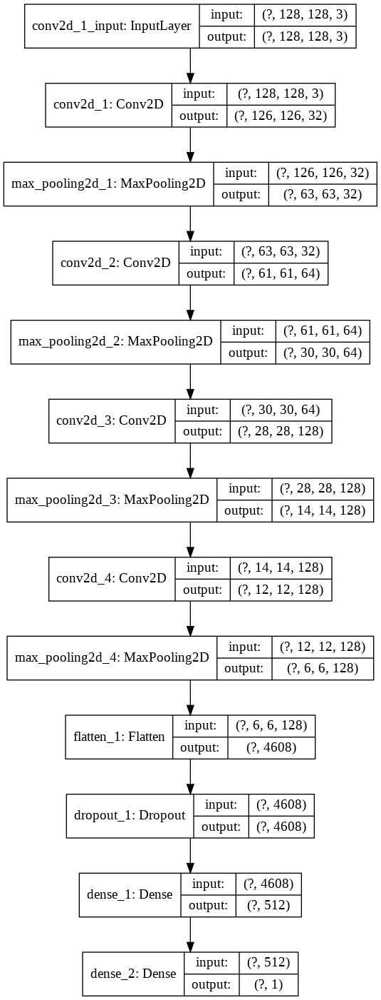

# Detect-you-

## Overview
A simple Convolution Neural Network using Keras deep learning library to detect “you” whenever you are in front of your laptop. For more information please refer my website here https://mlprojectshub.blogspot.com/2020/07/a-convolution-neural-network-application.html

 **capturing_images.py** : This is used to create our own dataset of our images for our model.
 
 **run model.py** : Here comes the actual CNN model and it also saves the model as *model.h5* file.
 
 **detect_me(open_cv).py** : Here I used OpenCV to get access of our web-cam and test our model.

## Introduction to CNN
Why CNNs? We have DNN(Deep Neural Networks) which performs well on images but why CNNs? To know the reason, let us assume we have an RGB image of shape (64,64,3). This has 12288 (64*64*3) number of pixels (It is also called as 12288 Dimensional feature vector).It is not too bad! But as technology increased we can find images of (1000,1000,3) that has nearly 3 Million Dimensional feature vector. 

These 3M Dimensional feature vector leads to large number of parameters(~=3 Billion parameters).It's difficult to get enough data to prevent neural network from overfitting .And also, the computational requirements and the memory requirements to train a neural network with three billion parameters is just a bit infeasible. So we use Convolutional Neural Networks.

## Introduction and working

1. First you need an input image of any shape(let us consider (5,5,3) for now), it may be a RGB image or a gray scale image and you need a filter of shape (3,3) or (5,5) or so on... You can take of any shape of filter/ kernel, but most probably we consider these shape. But let us consider we are using a (3,3) filter for now.
2. Now take that filter keep it on the starting (top left) of the image and do a dot product of image pixels and the filter. Then move one stride and again perform the product of image pixels and filter and so on.
3. Here the dot product is nothing but, we are doing convolution for image and filter.( (5,5,3) * (3,3)  where * denotes convolution).Note that here we are using only one filter.

4. That's all. Now our input image of shape (5,5,3) becomes (3,3,3) image. You can notice that image is shrinking here. We can also say is as, the CNN is extracting the features from the images.
5. Here the edges of the image is involving less number of time in the convolution. This means that we are losing information at the edges of images. We don't want that! So we add padding layers.
6. To calculate the output shape of the image you can use the formula below

### Pooling

Now let's talk about pooling layer. Their goal is to subsample (i.e., shrink) the input image in order to reduce the computational load, the memory usage, and the number of parameters (thereby limiting the risk of overfitting). Reducing the input image size also makes the neural network tolerate a little bit of image shift.

Just like in convolutional layers, each neuron in a pooling layer is connected to the outputs of a limited number of neurons in the previous layer, located within a small rectangular receptive field. You must define its size, the stride, and the padding type, just like before. However, a pooling neuron has no weights; all it does is aggregate the inputs using an aggregation function such as the max or mean.

Above figure shows a max pooling layer, which is the most common type of pooling layer. In this example, we use a 2 × 2 pooling kernel, a stride of 2, and no padding. Note that only the max input value in each kernel makes it to the next layer. The other inputs are dropped.

### Flatten

It just makes the output features into a N-Dimensional vector. For example you have an shirked image at some specific layer of shape (32,32,128), then this flatten makes this as a (32*32*128) dimensional feature vector. 

### Dense

This dense layer is also known as fully connected layers.

### My environment details:

> Windows 10

> Python 3.5.6

### Python packages:

> Open CV (opencv-python)

> PIL (Pillow)

> keras (I used the one with tensorflow backend)

> numpy

### How to run the model:
1) Take some images(4000 images) with you present infront of webcam(2000 images) and without you(2000 images) infront of webcam by runnig the capturing_images.py file and store the both files in Train dir.

2) Similarly, take some images(1600 images) with you(800 images) and without you(800 images) infront of webcam by runnig the capturing_images.py file and store the both files in Validation dir.

3) Now make sure that both Train and Validation files are in one Directory.

4) Then run the run model.py file and save the model.

5) Finally, to see your outpyt running the detect_me(open_cv).py file.

### CNN Model Architecture:

